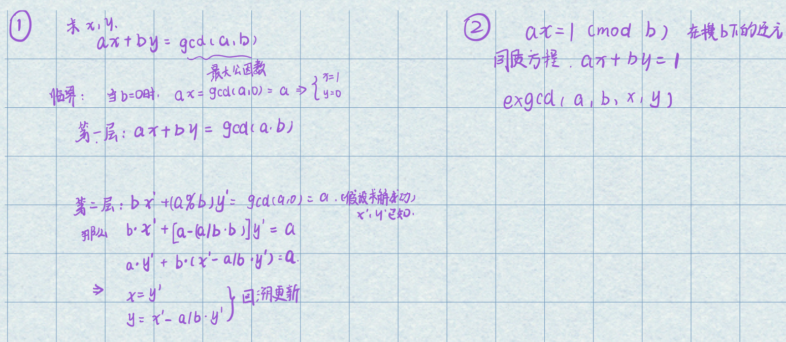

# algorithm
## graph
- [x] [Dijkstra](./algorithm/graph/dijkstra.cpp)
- [x] [Kruskal](./algorithm/graph/kruskal.cpp)
### tree
- [x] [LCA](./algorithm/graph/tree/lca.cpp) // 公共父节点, 树上路径
## string
- [x] [KMP](./algorithm/string/kmp.cpp) // 字符串字串匹配
# basic

# datastruct
- [x] [DSU](./datastruct/dsu.cpp) // 并查集
- [x] [Segtree](./datastruct/segtree.cpp) // 线段树, 擅长区间修改, 求区间和
- [x] [BIT](./datastruct/bit.cpp) // 树状数组, 单点修改, 求区间和
- [x] [STtable](./datastruct/sttable.cpp) // 常数级找区间最大值
# dp

# geometry

# math

- [x] [Qpow](./math/qpow.cpp) // 快速幂
- [x] [Exgcd](./math/exgcd.cpp) // 可以用来求逆元
- 使用说明: 
  
- [x] [primes](./math/primes.cpp)